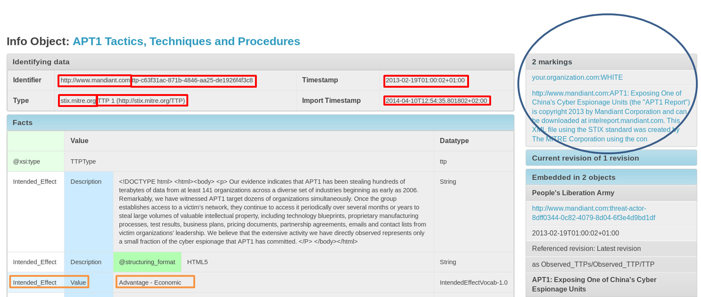
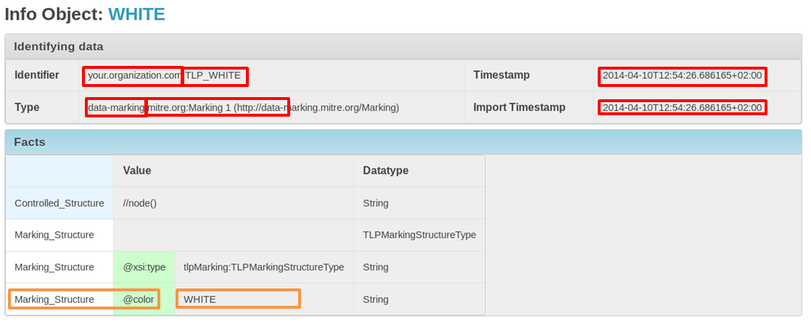

Using the DINGOS custom search
==============================

.. contents::

.. highlight:: none
   :linenothreshold: 2

This section explains the use of the DINGOS custom search feature.
The feature allows you to search for InfoObjects or facts within
InfoObjects by issuing queries like this::

      object: iobject_type.name = 'TTP' && import_timestamp younger '2d'
    | fact: [Intended_Effect/Value] = "Advantage - Economic" 
    | marked_by: (fact: [Marking_Structure@color]='WHITE')
    |F> csv('identifier','name')

A first example explained
-------------------------

To understand the example query presented above,
consider the following InfoObject shown as displayed in Mantis
(which is built on top of Dingos):

   An example InfoObject

The highlights in red, orange, and blue mark criteria that may be used
for filtering: characteristics of the object (red), facts within
the object (orange), and markings (blue).

The example InfoObject is marked by two objects, one of which is
represented in the following figure.

   An example marking

   Note that these examples use marking objects as represented in STIX and CybOX,
   but Dingos can use any kind of InfoObject as marking of another InfoObject.

Let us now return to the example query from above::

      object: iobject_type.name = 'TTP' && import_timestamp younger '2d'
    | fact: [Intended_Effect/Value] = "Advantage - Economic" 
    | marked_by: (fact: [Marking_Structure@color]='WHITE')
    |F> csv('identifier','name')

The query defines filter criteria with respect to the InfoObject (line 1),
a fact within the object (line 2), and a marking of the object (line 3).
Because markings are themselves represented by InfoObjects, a filter
criteria referring to a marking (i.e., introduced with ``marked_by``) must
itself define a complete filter and thus may (or rather must) use
the keywords ``object:`` and/or ``fact:`` to describe the filter to be
applied to marking objects. Then, after the ``|F>``, the query defines
the formatting for the output. Here, we want a list of comma-separated values,
providing for each found object the identifier and name. The
output could look something like this (where the first line contains the column names)::

     identifier,name
     http://www.mandiant.com:ttp-c63f31ac-871b-4846-aa25-de1926f4f3c8,"APT1 Tactics, Techniques and Procedures"

So, to put the query in natural language:

     Return all InfoObjects (1) whose type is called ``TTP`` and which
     have been imported into the system less than two days ago; (2)
     that contain a fact where the fact-term contains the clause
     ``Intended_Effect/Value`` and has the value ``Advantage -
     Economic``; (3) that is marked by an object that contains a fact
     with fact-term ``Marking_Structure@color`` and fact-value
     ``WHITE``. Structure the result as comma-separated values file
     with two columns containing identifier, and name, respectively.

Query syntax
------------

Dingos queries may be made for InfoObjects and facts: in both cases, the syntax of the query is
the same; whether InfoObjects or facts are queried is governed by the query form: Dingos has
query forms for InfoObjects and for facts.

Dingos queries have the following form::

      <filter_type>: <filter> | ... | ... |F> <format-command>(format arguments)

Note that the same `<filter_type>` may occur more than once in a query. To understand why this may make sense, consider 
a query for all InfoObjects that contain the facts ``foo/bar = 'this'`` and ``blah/bleh = 'blub'``::

        fact: [foo/bar] = 'this' | fact: [blah/bleh] = 'blub'

is the right query for this. The query ``fact: [foo/bar] = 'this' && [blah/bleh] = 'blub'`` on the other hand would
not work, because it would require one and the same fact to have both the fact term ``foo/bar`` as well as ``blah/bleh``
(and, also, both the value ``this`` and ``blub``).

Filter Types
............

``<filter_type>`` is one of the following:

=============== ================================================================================================================================
  ``object``     when querying objects: object must have the characteristics specified in ``<filter>``
                 when querying facts: fact must occur in an object that has the characteristics specified in ``<filter>``
 ``!object``     when querying objects: object may not have the characteristics specified in ``<filter``>
                 when querying facts: fact may not occur in an object that has the characteristics specified in ``<filter>``
 ``fact``        when querying objects: object must contain fact with characteristics as specified in ``<filter>``
                 when querying facts: fact must have the characteristics specified in ``<filter>``
 ``!fact``       when querying objects: object may not contain fact with characteristics as specified in ``<filter>``
                 when querying facts: fact may not have the characteristics specified in ``<filter>``
 ``marked_by``   when querying objects: object must be marked by an object that has the characteristics specified in ``<filter>``
                 when querying facts: fact must occur in an object marked by an object that has the characteristics specified in ``<filter>``
 ``!marked_by``  when querying objects: object must not be marked by an object that has the characteristics specified in ``<filter>``
                 when querying facts: fact may not occur in an object marked by an object that has the characteristics specified in ``<filter>``
=============== ================================================================================================================================

Filters
.......

``<filter>`` is of the following form:

``object`` and ``!object`` filters
,,,,,,,,,,,,,,,,,,,,,,,,,,,,,,,,,

``object`` or ``!object`` filters have the following form::

           <key> <operator> <value> && <key> <operator> <value> || ...

where ``key`` denotes an object characteristic such as ``identifier.uri`` or ``iobject_type.name`` and the ``<operator>`` 
is an operator such as ``=``, ``contains``, ... -- a complete list of operators is given below. These key-value
constraints can be joined by boolean operators ``&&`` (*and*) and ``||`` (*or*).

The ``object:`` filter may contain constraints ``<key> <operator> <value>`` for the following keys:

===================== ======================================================================================
identifier.namespace  Namespace of the object identifier, e.g. ``http://mandiant.com``
identifier.uid        UID of the object identifier, e.g., ``ttp-c63f31ac-871b-4846-aa25-de1926f4f3c8``
object_type.name      Name of the InfoObject type, e.g., ``TTP``
object_type.namespace Namespace of the InfoObject type, e.g., "stix.mitre.org"
name                  InfoObject name
timestamp             InfoObject timestamp (as given in object's revision info)
import_timestamp      Timestamp when InfoObject was imported into the system.
object_family         InfoObject family
===================== ======================================================================================

``fact`` and ``!fact`` filters
,,,,,,,,,,,,,,,,,,,,,,,,,,,,,,

For ``fact`` or ``!fact`` filters, in addition to the key-value constraints, the following additional constraints
can be specified:

- ``[<fact_term>] <operator> <value>``

  Here, a regular-expression match is carried out for the ``<fact_term>``; the result is constraint to
  all facts where the fact term matches the regular expression given in ``<fact_term>`` and the value of
  the fact meets the requirement specified by ``<operator>`` and ``<value>``

- ``[<fact_term>@<attribute>] <operator> <value>``

  Here, a regular-expression match is carried out for the ``<fact_term>`` and a separate regular-expression match
  is carried out for the ``<attribute>``; the result is constraint to
  all facts where the fact term and attribute match the regular expressions given in ``<fact_term>`` and ``<attribute>``
  respectively; furthermore, the value of the fact meets the requirement specified by ``<operator>`` and ``<value>``

- ``@[<attribute>] <operator> <value>``

  Here the filter is constraint to facts that carry an attribute where the key matches ``<attribute>`` and the
  value meets the condition specified by ``<operator>`` and ``<value>``. For example consider the following
  piece of XML::

                <cybox:Observable>
                  <cybox:Object>
                    <cybox:Properties xsi:type="AddressObject:AddressObjectType" category="ipv4-addr">
                       <AddressObject:Address_Value condition="InclusiveBetween">101.80.0.0##comma##101.95.255.255</AddressObject:Address_Value>
                    </cybox:Properties>
                  </cybox:Object>
                </cybox:Observable>

  So, the fact ``AddressObject/Address_Value = '101.80.0.0##comma##101.95.255.255'`` is modified by the attribute
  ``condition = "InclusiveBetween"``. In the flattened representation of Dingos, it seems that this relationship
  between attribute and attributed fact gets lost:

  .. figure:: images/custom_search_example_attributed_fact.PNG
      :scale: 100 %
      :align: center

      DINGOS representation of an attribute

  But the relationship is not lost: the following query filters for all facts that are attributed with 
  ``condition = "InclusiveBetween"`` and returns, 
  amongst others, the fact ``AddressObject/Address_Value = '101.80.0.0##comma##101.95.255.255'``::
	
          fact: @[condition] = 'InclusiveBetween'

The ``fact:`` filter may contain constraints ``<key> <operator> <value>`` for the following keys:

===================== ======================================================================================
fact_term             Fact term, e.g. ``Properties/Address_Value``
attribute             Attribute key, e.g. ``condition``
value                 Value of a fact or attribute, e.g. ``InclusiveBetween`` or ``101.80.0.0``
===================== ======================================================================================

``marked_by`` and ``!marked_by`` filters
,,,,,,,,,,,,,,,,,,,,,,,,,,,,,,,,,,,,,,,,

For ``marked_by`` and ``!marked_by``, the ``<filter>`` must be a complete sub-query of form ``<filter_type>: <filter> | ... | ...``;
the query **must** be enclosed in parentheses: ``marked_by: (object: ...| ...)`` is correct, whereas ``marked_by: object: ...`` is not. 

Operators
---------

In ``<key> <operator> <value>`` the following operators are supported:

String comparison
.................

All comparision operators can be prefixed with ``!`` for the negation, e.g., ``!=`` for inequality, etc. 

======================= =======================================================================================
 ``a = b``               ``a`` and ``b`` are equal
 ``a contains b``         ``a`` is contained in b
 ``a icontains b``        ``a`` is contained in ``b`` (case insensitive)
 ``a regexp b``           ``a`` matches regular expression ``b``
 ``a iregexp b``          ``a`` matches regular expression ``b`` (case insensitive)
 ``a startswith b``       ``b`` is ``a`` prefix of ``a``
 ``a istartswith b``      ``b`` is ``a`` prefix of ``a`` (case insensitive)
 ``a endswith b``         ``b`` is ``a`` suffix of ``a``
 ``a iendswith b``        ``b`` is ``a`` suffix of ``a`` (case insensitive)
======================= =======================================================================================

Timestamp comparison
....................

**Note**: Date comparison is only possible for ``timestamp`` and ``import_timestamp`` of an InfoObject, *not*
for values of facts that represent dates. This is, because all values are stored as strings in the database.

======================= =======================================================================================
 ``t1  = t2``             timestamps ``t1`` and ``t2`` are equal
 ``t younger p``          timestamp ``t`` is younger than period ``p`` (see below for period specification)
 ``t range r``            timestamp ``t`` is in range ``r`` (see below for range specification)
======================= =======================================================================================

Periods can be specified in days (e.g., ``"2d"``), hours (e.g., ``"6h"``), and minutes (e.g., (``"10m"``).

Ranges are specified as follows::

             "YYYY:mm:dd HH:MM:SS -- YYYY:mm:dd HH:MM:SS

Formatting Syntax
-----------------

Comma-separated values
......................

The syntax for specifiying output as comma-separated values is as follows::

    csv("Column Name1: column1", "Column Name 2: column2 , ...)

where a ``column`` is one of the following:

Columns for object queries
,,,,,,,,,,,,,,,,,,,,,,,,,,

===================== ======================================================================================
identifier.namespace  Namespace of the object identifier, e.g. ``http://mandiant.com``
identifier.uid        UID of the object identifier, e.g., ``ttp-c63f31ac-871b-4846-aa25-de1926f4f3c8``
identifier            Identifier, printed as ``<namespace>:<uid>``
object_type.name      Name of the InfoObject type, e.g., ``TTP``
object_type.namespace Namespace of the InfoObject type, e.g., "stix.mitre.org"
object_type           InfoObject type, printed as ``<namespace>:<name>``
name                  InfoObject name
timestamp             InfoObject timestamp (as given in object's revision info)
import_timestamp      Timestamp when InfoObject was imported into the system.
object_family         InfoObject family 
===================== ======================================================================================

Columns for fact queries
,,,,,,,,,,,,,,,,,,,,,,,,

============================= ======================================================================================
fact_term                     fact term of fact
attribute                     attribute of fact
value                         value of fact
fact_term_with_attribute      fact term and attribute of fact printed as "<fact_term>@<attribute>"
iobject.identifier.namespace  Namespace of the object identifier, e.g. ``http://mandiant.com``
iobject.identifier.uid        UID of the object identifier, e.g., ``ttp-c63f31ac-871b-4846-aa25-de1926f4f3c8``
iobject.identifier            Identifier, printed as ``<namespace>:<uid>``
iobject.object_type.name      Name of the InfoObject type, e.g., ``TTP``
iobject.object_type.namespace Namespace of the InfoObject type, e.g., "stix.mitre.org"
iobject.object_type           InfoObject type, printed as ``<namespace>:<name>``
iobject.name                  InfoObject name
iobject.timestamp             InfoObject timestamp (as given in object's revision info)
iobject.import_timestamp      Timestamp when InfoObject was imported into the system.
iobject.object_family         InfoObject family 
============================= ======================================================================================

