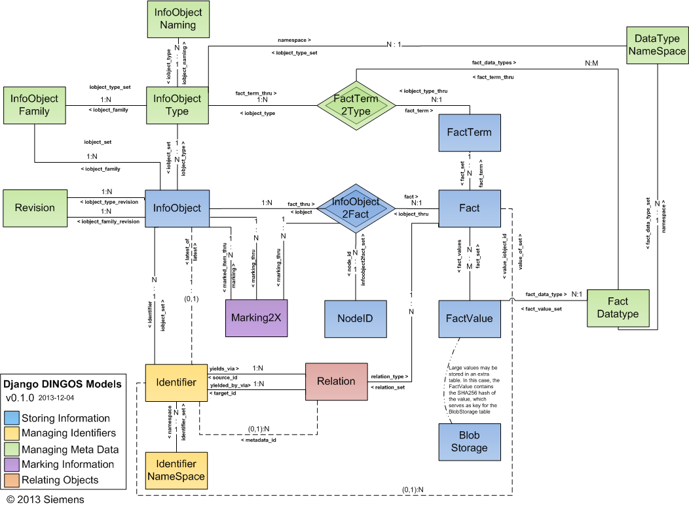

DINGOS Model Overview
=====================

   DINGOS Model Overview

   Overview of DINGOS models and their relationships.

Please refer to the :download:`DINGOS Developers' Overview <reference/dingos_data_model.pdf>` of the DINGOS models.
The source code file `models.py`_ is extensively documented. Very readable and browsable documentation
is generated by Django under the admin url ``/admin/docs/models`` -- be sure to include
``django.contrib.admindocs`` in your list of installed applications and the following in your ``url.py`` file::

           urlpatterns = patterns('',
                                  # Admin documentation:
                                  url(r'^admin/doc/', include('django.contrib.admindocs.urls')),

.. _models.py:https://github.com/siemens/django-dingos/blob/master/dingos/models.py

 

