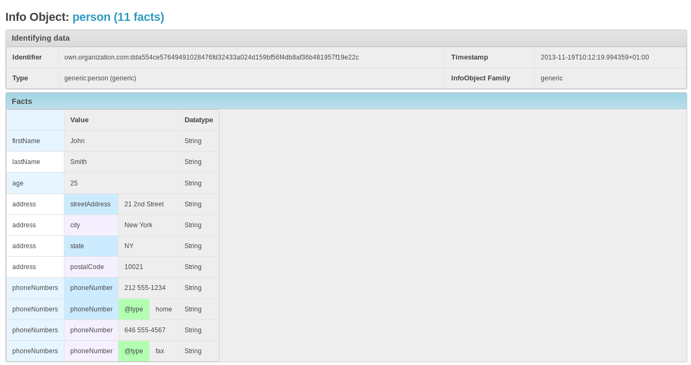

========================
What DINGOS is all about
========================

Dingos ("Django: INformation in Generic ObjectS") is a Django
application that allows you to manage data structured in hierarchies
in a generic way. It was written for dealing with cyber-threat
information expressed in standards such as CybOX and STIX as part of
the MANTIS Cyber Threat Information Management Framework, but may also
have other applications.

Consider the following XML-based example::

    <person>
        <firstName>John</firstName>
        <lastName>Smith</lastName>
        <age>25</age>
        <address>
            <streetAddress>21 2nd Street</streetAddress>
            <city>New York</city>
            <state>NY</state>
            <postalCode>10021</postalCode>
        </address>
        <phoneNumbers>
            <phoneNumber type="home">212 555-1234</phoneNumber>
            <phoneNumber type="fax">646 555-4567</phoneNumber>
        </phoneNumbers>
    </person>

The generic XML import of Dingos stores this information by
extracting the following "facts":

+--------------------------------------+---------------+
| Fact Term                            | Fact Value    |
+======================================+===============+
| person/firstName                     | John          |
+--------------------------------------+---------------+
| person/lastName                      | Smith         |
+--------------------------------------+---------------+
| person/age                           | 25            |
+--------------------------------------+---------------+
| person/address/streetAddress         | 21 2nd Street |
+--------------------------------------+---------------+
| person/address/city                  | New York      |
+--------------------------------------+---------------+
| person/address/state                 | NY            |
+--------------------------------------+---------------+
| person/address/postalCode            | 10021         |
+--------------------------------------+---------------+
| person/phoneNumbers/phoneNumber@type | home          |
+--------------------------------------+---------------+
| person/phoneNumbers/phoneNumber      | 212 555-1234  |
+--------------------------------------+---------------+
| person/phoneNumbers/phoneNumber@type | fax           |
+--------------------------------------+---------------+
| person/phoneNumbers/phoneNumber      | 646 555-4567  |
+--------------------------------------+---------------+

This list of facts is stored as a Dingo "InfoObject".
The data model also keeps track of positional information
that associates the attribute 'home' with the first and attribute
'fax' with the second telephone number.

Viewing the imported file (without any further customization) currently looks like follows:

Dingos further offers:

- a configurable parser that enables Dingos
  to deal with rather complicated data structures such as STIX
  and CybOX that require extraction of embedded structures,
  derivation of object identifiers, etc.

- a high degree of sharing in the data model: if a piece
  of data occurs several times (e.g., in several imports), then
  it is only stored once and referenced at all occurrences.
